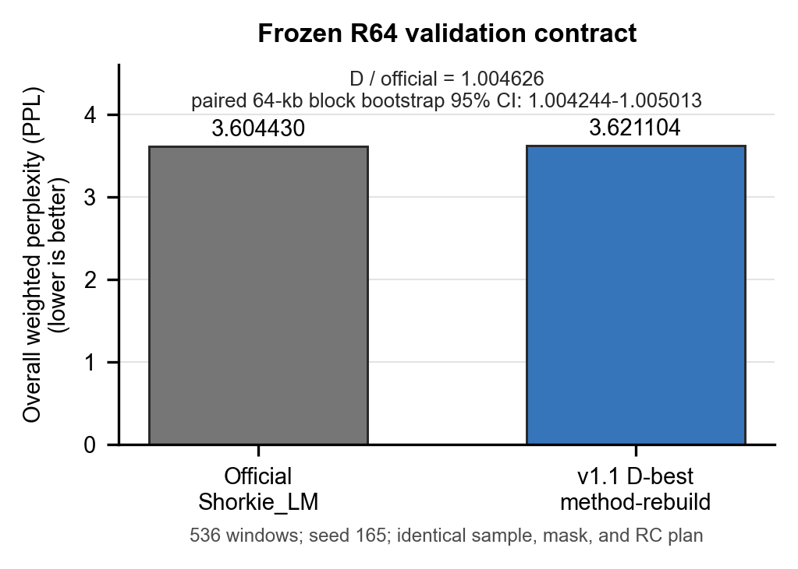

# Shorkie PyTorch

> **Unofficial community PyTorch reproduction of Shorkie_LM. Not affiliated
> with or endorsed by Calico or the original Shorkie authors.**

[](https://github.com/ZiyanZhuang/shorkie-pytorch/actions/workflows/ci.yml)
[](LICENSE)
[](https://huggingface.co/ZiyanZhuang/shorkie-lm-165-method-rebuild-v1.1)

[中文说明](README.zh-CN.md)

This project makes the 16,384-bp Shorkie masked DNA language model easier to
inspect, evaluate, and train without a TensorFlow runtime. It is not the
paper's eight-fold supervised Shorkie model with 5,215 expression and
epigenomic tracks.

Please cite and visit the [original Shorkie paper](https://doi.org/10.1101/2025.09.19.677475),
[official repository](https://github.com/calico/shorkie-paper), and
[official documentation](https://khchao.com/shorkie/) first.

## Reproduction result



| Model | Overall weighted PPL |
|---|---:|
| Official Shorkie_LM | 3.604430 |
| v1.1 D-best method-rebuild | 3.621104 |

Lower is better. Both models were evaluated on the same 536 reconstructed R64
validation windows, seed 165, seven passes of 2,457 masked positions, and the
same sample, masking, and reverse-complement plan. D-best is 0.4626% higher
(worse); its paired 64-kb block-bootstrap PPL ratio is 1.004244-1.005013 at 95%
confidence. This is a comparison on reconstructed data, not the authors'
original-corpus headline result.

The official TensorFlow-to-PyTorch forward-path parity is documented
separately in [evaluation evidence](docs/evaluation.md); it is implementation
validation, not model performance.

## Evidence boundary

- Input: `[batch, 16384, 170]` -- four DNA channels, one MLM mask channel, and
  165 species channels.
- Output: `[batch, 16384, 4]` unnormalized A/C/G/T logits.
- The released v1.1 D-best weight was trained on an independently rebuilt
  Ensembl Fungi release 59 corpus. It is not the authors' original corpus.
- Prefer the authors' released `165_Saccharomycetales` corpus when GCP
  requester-pays access is available. The method-rebuild contract is an
  independent audit and fallback, not a more authoritative dataset.
- Paper Figures 3-7 supervised performance has not been reproduced by this
  checkpoint. MLM surprisal is not supervised Shorkie `logSED`.

See [limitations](docs/limitations.md) before interpreting biological results.

## Install

This release candidate is not on PyPI. Install the tagged source or a wheel
from the GitHub prerelease:

```bash
python -m venv .venv
source .venv/bin/activate
python -m pip install --upgrade pip
python -m pip install "git+https://github.com/ZiyanZhuang/shorkie-pytorch.git@v0.1.0-rc1"
```

Windows PowerShell activation is `.venv\Scripts\Activate.ps1`.

## Download the released weight

```bash
python -m pip install "huggingface_hub>=0.28"
hf download ZiyanZhuang/shorkie-lm-165-method-rebuild-v1.1 \
  --revision v0.1.0-rc1 \
  --local-dir weights/shorkie-v1.1-d
```

The same sanitized bundle is mirrored in the
[GitHub prerelease](https://github.com/ZiyanZhuang/shorkie-pytorch/releases/tag/v0.1.0-rc1).
Verify `SHA256SUMS` before loading. Public loading accepts only
`model.safetensors + config.json`.

## Five-minute masked-base example

Prepare a FASTA record containing exactly 16,384 bases, then run:

```bash
python examples/make_example_fasta.py --output window_16384.fa

shorkie-torch-predict \
  --model-dir weights/shorkie-v1.1-d \
  --fasta window_16384.fa \
  --positions 100 200 300 \
  --species-index 109
```

## Training and evaluation

```bash
shorkie-torch-train --corpus-root /path/to/corpus --out runs/train/summary.json

shorkie-torch-ppl \
  --model-dir /path/to/model \
  --corpus-root /path/to/corpus \
  --windows-tsv /path/to/windows.tsv \
  --gtf-gz /path/to/genes.gtf.gz \
  --split valid --rc-mode seeded --run-dir runs/ppl-valid
```

The corpus must obey the documented four-field ZLIB TFRecord contract. See the
[data contract](docs/data_contract.md), [architecture and math](docs/architecture.md),
and [training contract](docs/training.md).

## Public API

```python
from shorkie_torch import (
    ShorkieConfig,
    ShorkieLM,
    ShorkieShardDataset,
    load_pretrained,
    make_mlm_batch,
    make_stream_loader,
    weighted_mlm_loss,
)
```

The explicit conversion CLI is only for trusted legacy checkpoints and must
never be used on untrusted pickle files.

## Citation and contact

The original Shorkie paper is the preferred citation. If this PyTorch port or
the released method-rebuild weight is useful, you may additionally cite this
version using [CITATION.cff](CITATION.cff).

**Ziyan Zhuang**  
Tianjin University; Shenzhen Loop Area Institute  
[ziyan@tju.edu.cn](mailto:ziyan@tju.edu.cn)  
[GitHub](https://github.com/ZiyanZhuang) · [Hugging Face](https://huggingface.co/ZiyanZhuang)

This port began from upstream commit `c6003ce98db2156891c424f08352e900b97db55d`
and was validated against `71bf5164c4f4448827cfc0d3b4715b736a3e6ba8`.
See [provenance](docs/provenance.md), [NOTICE](NOTICE), and
[third-party notices](THIRD_PARTY_NOTICES.md).

License: Apache-2.0.
