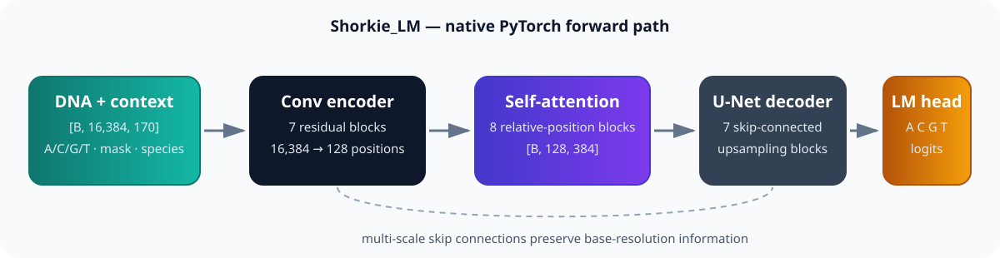

# Shorkie PyTorch

### A faithful, trainable PyTorch reproduction of the 16 kb Shorkie fungal DNA language model

[](https://github.com/ZiyanZhuang/shorkie-pytorch/actions/workflows/ci.yml)
[](LICENSE)
[](https://pytorch.org/)
[](https://huggingface.co/ZiyanZhuang/shorkie-lm-165-method-rebuild-v1.1)

[Quickstart](#quickstart) · [Pretrained weights](#pretrained-weights) · [Training](#training-your-own-model) · [Evaluation](#reproduction-result) · [中文说明](README.zh-CN.md)

**Shorkie PyTorch** brings the Shorkie_LM architecture to an idiomatic PyTorch
workflow: native modules, streaming TFRecords, reproducible masked-language-model
training, strict `safetensors` loading, and full-position perplexity evaluation.
The released 13.7M-parameter checkpoint was trained on a 165-genome
Saccharomycetales method-rebuild corpus and reaches within **0.47% PPL** of the
official TensorFlow language model under the same fixed R64 evaluation plan.

> Unofficial community reproduction. Shorkie was created by the Calico team;
> please cite the [original paper](https://doi.org/10.1101/2025.09.19.677475)
> and visit the [official repository](https://github.com/calico/shorkie-paper).

## What you get

- A readable PyTorch implementation of the convolutional encoder, relative-position
  attention tower, U-Net decoder, and nucleotide LM head.
- Source-matched 15% MLM sampling, 80/10/10 corruption, reverse-complement
  augmentation, exon/repeat weighting, and routed L2 regularization.
- Restartable training over sharded ZLIB TFRecords without loading the full corpus
  into memory.
- Public `safetensors` weights, masked-base prediction, and fixed-window PPL tools.
- Measured TensorFlow-to-PyTorch forward parity—not merely matching tensor shapes.



## Quickstart

Python 3.10–3.13 and PyTorch 2.6+ are supported.

```bash
python -m venv .venv
source .venv/bin/activate                # Windows: .venv\Scripts\Activate.ps1
python -m pip install --upgrade pip
python -m pip install "git+https://github.com/ZiyanZhuang/shorkie-pytorch.git@v0.1.0-rc1"
```

Download the checkpoint:

```bash
python -m pip install "huggingface_hub>=0.28"
hf download ZiyanZhuang/shorkie-lm-165-method-rebuild-v1.1 \
  --revision v0.1.0-rc1 \
  --local-dir weights/shorkie-v1.1-d
```

Predict masked nucleotides in a 16,384 bp sequence:

```bash
python examples/make_example_fasta.py --output window_16384.fa

shorkie-torch-predict \
  --model-dir weights/shorkie-v1.1-d \
  --fasta window_16384.fa \
  --positions 100 200 300 \
  --species-index 109
```

Or use the Python API:

```python
from shorkie_torch import ShorkieConfig, ShorkieLM, load_pretrained

model = ShorkieLM(ShorkieConfig())
model = load_pretrained(model, "weights/shorkie-v1.1-d")
model.eval()
```

## Architecture at a glance

| Component | Shape / role |
|---|---|
| Input | `[B, 16384, 170]`: A/C/G/T, MLM mask, 165 species channels |
| Encoder | 7 residual downsampling blocks, 96 → 384 channels |
| Context tower | 8 relative-position self-attention blocks at `[B, 128, 384]` |
| Decoder | 7 skip-connected U-Net upsampling blocks |
| Output | `[B, 16384, 4]` unnormalized A/C/G/T logits |

The implementation keeps channel-last tensors at the public boundary to match
the original Keras contract. See [architecture and mathematical details](docs/architecture.md).

## Reproduction result


| Model | Overall weighted PPL ↓ |
|---|---:|
| Official Shorkie_LM | **3.604430** |
| This repo: v1.1 D-best | **3.621104** |

The paired comparison uses the same 536 reconstructed R64 validation windows,
seed 165, seven passes × 2,457 masked positions, and identical sample, mask, and
reverse-complement plans. Our checkpoint is 0.4626% higher (worse); the paired
64 kb block-bootstrap PPL-ratio 95% CI is 1.004244–1.005013.

The port itself also reproduces the official TensorFlow forward path to small
floating-point error:

| Parity target | Maximum absolute error |
|---|---:|
| probabilities | `1.1027e-6` |
| centered logits | `5.4836e-6` |
| first attention output | `4.0531e-6` |

Full evaluation definitions and machine-readable results are in
[docs/evaluation.md](docs/evaluation.md) and [benchmarks/v0.1.0-rc1](benchmarks/v0.1.0-rc1/).

## Pretrained weights

The Hugging Face release contains only the portable inference state:

- `model.safetensors` — 356 tensors, SHA-256
  `2b23ba80b84c7e3bdd8d412a7580c483357992cba5607aaeabf78fd683eb9cd5`
- `config.json` — architecture and input contract
- `training_summary.json` and `evaluation.json` — concise provenance and metrics

The checkpoint is v1.1 routed-L2, training branch D, epoch 3505 / global step
525900. Optimizer state, local paths, logs, credentials, and training-machine
metadata are not included.

## Training your own model

```bash
shorkie-torch-train \
  --corpus-root /path/to/corpus \
  --out runs/train/summary.json
```

The loader streams the four-field Shorkie records
(`sequence`, `mask`, `repeat_mask`, `species`) and assigns shards uniquely across
workers. Details are in the [data contract](docs/data_contract.md) and
[training guide](docs/training.md).

Run the fixed-window full-position evaluator with:

```bash
shorkie-torch-ppl \
  --model-dir /path/to/model \
  --corpus-root /path/to/corpus \
  --windows-tsv /path/to/windows.tsv \
  --gtf-gz /path/to/genes.gtf.gz \
  --split valid --rc-mode seeded --run-dir runs/ppl-valid
```

## Scope

This repository reproduces **Shorkie_LM**, the masked DNA language model. It is
not the paper's eight-fold supervised Shorkie model with 5,215 genomic tracks.
The released checkpoint was trained on an independently reconstructed Ensembl
Fungi release 59 corpus, not the authors' original training files; use the
official corpus when available. Figures 3–7 supervised performance is therefore
outside the claims of this release. See [limitations](docs/limitations.md).

## Citation

Please cite the original Shorkie paper first. If this PyTorch implementation or
checkpoint also helps your work, an additional software citation is available
in [CITATION.cff](CITATION.cff).

**Ziyan Zhuang**  
Tianjin University · Shenzhen Loop Area Institute  
[ziyan@tju.edu.cn](mailto:ziyan@tju.edu.cn) · [GitHub](https://github.com/ZiyanZhuang) · [Hugging Face](https://huggingface.co/ZiyanZhuang)

Apache-2.0 licensed. Contributions and reproducibility reports are welcome.

If this project is useful, consider leaving a ⭐—it helps other genomics
researchers discover the PyTorch implementation.
