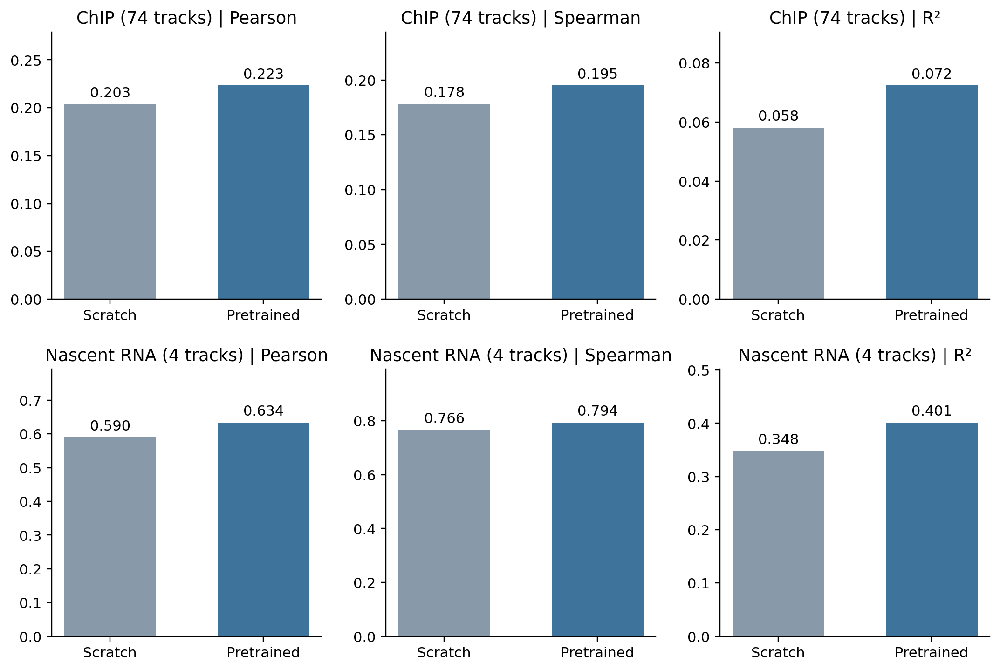
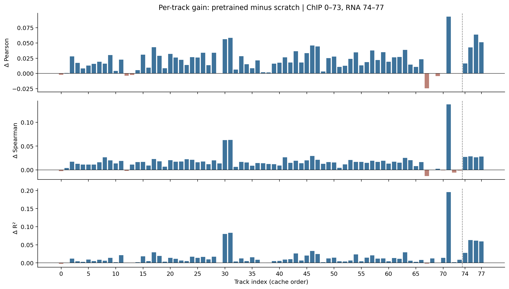

# Shorkie 酵母基因组模型公开数据适配复现技术报告

**版本：v1.0；证据截止日期：2026年9月17日。**

**报告性质：阶段性技术与实验报告，不是原论文性能严格复现声明，也不是新算法有效性论文。**

本报告的主要实证对象为 `public-chip74-rna4-normalized-v4-parallel4`：以重建语料预训练权重初始化的多轨道监督模型，与随机初始化模型分别完成八折训练，并在公开构建的74条ChIP与4条nascent RNA轨道上进行折外预测（out-of-fold，OOF）评估。报告将历史探索、当前正式结果、方法适配和未完成任务分开陈述。

## 摘要

Shorkie的核心路线是先从真菌基因组进行DNA语言模型预训练，再将序列表示迁移至酵母多轨道信号预测及后续调控分析。本项目在无法直接沿用全部作者原始语料与处理后数据的条件下，建立了基于PyTorch、重建预训练语料和公开监督数据的适配实现。当前正式监督数据包含1,855个16,384 bp输入窗口；每个窗口对应896个输出bin、78条信号轨道。采用预训练微调与随机初始化两个分支、八折基因组区域划分，共完成16个监督模型及其OOF预测。

全部16个模型均根据既定验证早停规则结束，而非被ACP时间预算中断。队列记录总运行时间为30,544.95秒，约8.48小时。完整性审计核实了OOF与最佳检查点哈希的对应关系、held-out索引的正确性、预测形状以及全部预测值的有限性和非负性。八折OOF合并后，ChIP轨道平均Pearson由scratch的0.203469提高至预训练微调的0.223263，平均R²由0.058090提高至0.072387；RNA轨道平均Pearson由0.589980提高至0.633575，平均R²由0.348359提高至0.401319。ChIP的74条轨道中，65条Pearson、68条Spearman及70条R²获得提升；RNA的4条轨道在三项指标上均获得提升。

这些结果支持“当前预训练微调流程在本公开数据适配任务上较scratch流程具有正向收益”的阶段性结论，但不能隔离预训练的独立因果效应：两分支在学习率和输入通道等方面存在差异，且仅使用一个固定训练种子。当前ChIP绝对表现仍较低；RNA结果仅覆盖两个WT条件的双链信号，不代表广泛细胞状态或扰动响应预测能力。原文与本项目在数据、标签处理、损失数值实现和评估口径上均存在适配差异，因此跨研究数值比较仅作描述性参照。

## 1. 研究问题与复现声明

本阶段首先回答三个问题：一是能否在现有计算资源与公开数据条件下稳定实现Shorkie式训练流程；二是所获得表示能否支持多轨道监督任务；三是预训练微调流程是否比本项目的scratch基线获得更好的held-out表现。单碱基分辨率改进、双向因果建模、约100M参数扩展和湿实验设计属于后续研究目标，不属于本阶段已经验证的能力。

本报告采用三个不同层级的“复现”概念：

| 层级 | 定义 | 本项目状态 |
|---|---|---|
| 实现与运行复现 | 实现主要架构和训练流程，能训练、停止、恢复和评估 | 已建立并有运行证据；不等于TensorFlow/PyTorch全流程等价 |
| 方法适配复现 | 保留预训练—多轨道监督—held-out评估路线，在公开数据和显式修改下验证 | 当前主要成果 |
| 原始实验严格复现 | 相同数据、预处理、划分、优化与评价口径下重现原文指标 | 未完成 |

“数据桶受限”在此主要指作者部分数据访问和下载条件不能直接满足，包括此前遇到的需要计费项目的GCS访问。它不是对所有原始数据均收费、不可公开获取或不可通过其他渠道获得的断言。公开原始数据是否与作者处理版本相同，需要分别核验。

## 2. 原始方法与本项目实现的关系

原文以真菌DNA语言模型作为初始化，再预测16 bp分辨率的酵母覆盖度信号。原文监督任务共5,215条轨道，包括1,128条ChIP-exo、20条ChIP-MNase、1,014条菌株RNA-seq与3,053条诱导时间点RNA-seq；Figure 3从bin-level、gene-level及标准化后跨条件关系等多个尺度进行评估。[1]

本项目延续卷积、Transformer与上采样组成的主干及任务输出头路线，使用已有PyTorch实现和源配置核验成果。当前正式监督训练器中，scratch分支接收4通道DNA输入；预训练分支保留170通道输入配置并设置酵母species column为114。两分支预测同一组78条轨道。预训练权重初始化并不意味着监督训练过程中主干被冻结。

需要明确的是，本报告不把“序列语言模型输出”“监督覆盖度预测”“变异效应评分”混为同一任务。监督输出为16 bp尺度的信号；它不能单凭该结果证明已具备单碱基变异效应或内含子优化能力。原文后续部分分析使用八模型平均预测；本报告OOF中每个窗口使用其held-out模型的预测，不是把八个模型对同一训练区域平均后作为测试分数。

## 3. 数据与数据准入

### 3.1 数据版本与规模

正式缓存版本为 `supervised-public-v1/cache-chip74-rna4-v1`。输入序列形状为1,855×16,384，监督目标形状为1,855×896×78。监督输出覆盖长度为14,336 bp，与16 bp/bin相对应；输入更长，不应把输入窗口全长误当作全部接受监督的位置。轨道索引0–73为ChIP，74–77为nascent RNA。

RNA标签是两个WT条件×正负链的4SU 6 min nascent polyA 5′ tag信号。四条轨道不是四个独立条件，也不是四个独立生物学重复。当前报告保留缓存轨道索引；完整实验编号、链与温度的逐项映射应以源manifest为准，不凭索引猜测生物学身份。

78与5,215的数量比约为1.5%，但轨道间存在相关性且信息量不同，不能把这个比例解释为信息量比例，也不能据此推导性能缩放关系。

### 3.2 基因组划分与泄漏边界

采用八折划分；对测试折f，验证折为(f+1) mod 8，其余折用于训练。窗口数依次为229、241、247、222、237、206、249、224，总数1,855。数据构建阶段已有区域划分核查；本轮OOF审计进一步验证每个预测索引集合恰好等于对应测试折，且同一分支每个窗口只作为一次held-out样本。

索引正确不等于排除了所有生物学相似性泄漏。区域边界不交叠不能自动保证不同区域无同源序列；预训练语料中的相似区域是否与特定监督测试终点存在泄漏风险，也需要更严格定义和证据。本报告不宣称已证明全流程同源独立性。

同一折内部窗口可能重叠。因此每轨道1,855×896=1,662,080个bin观测不是同等数量的独立基因组位置，更不是独立实验重复。本轮未使用这些bin构造显著性检验或狭窄置信区间。

### 3.3 数据准入与异常追踪

训练前检查READY manifest及文件哈希、序列与目标形状、目标有限性和非负性。正式模型contract记录缓存READY哈希，评估时再次核验。该机制能阻止意外缓存变化，但不能替代标签生物学含义的审查。

在数值故障调查中，对问题轨道ChIP69（GSM4450381）抽取48个窗口，从校验后的原始BigWig重算并与缓存逐值比较，结果一致；抽查窗口原始NaN比例为零。此结果支持该故障不能简单归因于这些缓存窗口损坏，但不证明所有轨道、全部区域的缺失值语义均已验证。

私有数据目前为少数菌株的全基因组测序资料。它们不提供表达、剪接或染色质状态监督标签；本报告未将其当作已完成的功能验证数据，也未声称它们已进入本轮78轨道正式结果。

## 4. 监督目标、数值故障及修订

### 4.1 当前正式目标

对于单个窗口的一条轨道，令y_i≥0为目标信号，z_i为输出logit，p_i=softplus(z_i)，Y=Σ_i y_i，S=Σ_i p_i，q_i=p_i/S，输出bin数B=896。当前coverage损失为：

\[
\mathcal L_{coverage}=\operatorname{mean}_{sample,track}\left[-\frac{1}{B}\sum_i y_i\log q_i+\frac{0.2}{B}(S-Y\log S)\right].
\]

训练总目标还包含源实现中的L2项。形状项与Poisson总量项保留了原方法的主要结构和0.2权重。但公开轨道可能包含归一化后的连续信号，因此该目标应描述为计数形式的信号拟合目标，不能无条件称为全部轨道原始整数计数的严格似然。

对于全零目标，形状项严格为零，总量项推动预测总量下降；对于正目标而预测总量趋近零，总量项给予相应惩罚。实现从logits计算log-softplus和logsumexp，避免先把极小率转成FP32的零再取log。

### 4.2 修订的必要性与非等价性

早期监督版本出现loss前向仍有限、梯度范数却非有限的错误。调查捕获了非常负的head logits及极低预测总量，部分率在FP32下下溢为零。原epsilon路径在该公开数据训练轨迹上出现不稳定；仅禁用非有限检查、忽略坏batch或降低学习率，不能回答公式和数值实现是否正确。

正式v4删除了原epsilon伪计数路径，使用真正归一化的q及稳定log-rate实现。z<-20时采用log(softplus(z))≈z的渐近表达，其数学近似误差很小，但不能把该误差界当作整个FP32训练的浮点误差界。覆盖度输出仍为softplus(z)；反向互补预测平均在log-rate域通过logaddexp实现对应运算。

该修订是明确的监督目标适配，不是原epsilon代码的逐位等价实现。早期v1/v2/v3故障记录和结果保留，未混入当前v4八折正式结果；新监督训练重置优化器、预热及早停状态，继续使用既有LM初始化权重。

### 4.3 已完成的数值验收

记录包括独立FP64参考公式与梯度对照、极端logits与零/正标签测试、真实故障logits测试、非有限输入拒绝、scratch跨5,000步warmup的6,000步训练检查，以及中断恢复一致性检查。并行部署进一步验证两个分支连续180步与90+90步恢复，在跨完整epoch后模型、Adam、训练状态与随机数状态完全一致，并生成RC OOF产物。

这些检查支持当前实现的数值可用性与所测恢复路径的正确性，不构成对所有输入和所有硬件设置的普遍证明。

## 5. 正式训练配置与计算环境

| 项目 | 当前正式设置 |
|---|---|
| 分支 | pretrained、scratch，各8折 |
| 随机种子 | 44；未开展多种子确认实验 |
| Batch | 每模型8 |
| 数值模式 | FP32，TF32关闭；确定性算法开启 |
| 优化器 | KerasAdam，β1=0.9、β2=0.999、epsilon=1e-7 |
| 基础学习率 | pretrained 2e-5；scratch 5e-4 |
| Warmup | 5,000 optimizer steps，从零学习率开始 |
| 梯度裁剪 | global norm 0.1，非有限范数停止 |
| 采样 | 每epoch完整随机排列；区别于作者TFRecord buffer shuffle |
| 每epoch步数 | 完整batch，最多500步；不人为重复样本补足500步 |
| 模型选择 | 验证集平均Pearson＋平均R²/4 |
| 早停 | 至少50 epochs；未改善计数>150；上限5,000 epochs |
| 训练增强 | 当前源参数路线不进行RC训练增强 |
| OOF | 最佳验证检查点；正向和反向互补预测平均 |
| 正式资源 | 一张H100 80GB；最多四个独立训练进程 |
| CPU | 每训练进程2个PyTorch线程 |
| 队列预算 | 本campaign累计120小时，非每进程各分配一张GPU |

主干与数据的变化均影响复现解释。不同学习率和输入通道使当前比较不属于严格单因素预训练消融。八个fold提供区域泛化信息，但不是八次独立随机种子重复。后续若要对预训练本身作更强推断，需要另设匹配配置控制。

### 5.1 基础设施优化及其实际采用范围

H100 80GB短测覆盖串行、GPU常驻缓存、CPU线程数、两/四模型并行、TF32和B16/B32。GPU常驻、B8、FP32的四模型短测总吞吐约为scratch 3.30 Mbp/s、pretrained 2.86 Mbp/s，相对对应串行基线提高约1.71与1.59倍；短测状态哈希一致。

正式并行队列为减少同时引入的变化，保留了原已验收训练器，没有加入GPU常驻缓存优化。因此不能将该短测吞吐或加速比当作本次正式端到端实测速率。正式总时间包含训练、验证、检查点与OOF；未提供严格匹配的串行全流程对照，不能由8.48小时单独推出加速倍数。

### 5.2 持久化、镜像及停止恢复

AFS保存代码、数据、结果、best/latest权重和不可覆盖的分段恢复快照。四模型使用独立目录、优化器与随机数状态，不做梯度共享，不等同于DDP，也不改变单模型batch。父队列管理累计墙钟预算、进程与完成回执；失败时停止派发新任务并请求其它训练进程安全保存。

项目经历过CCI重建后Python环境消失、ACP镜像缺少SciPy以及shell文件CRLF导致pipefail错误。相应操作措施为：将软件环境固定于已验收镜像，AFS保存易变产物；正式启动只校验依赖而不自动下载；校验实际GPU而不依据实例名称推断；shell文件保存LF并实际执行入口检查。2026年9月17日最后一次新CCI连接已验证Python依赖和环境验收标记均存在。

环境入口验证是必要条件，但本报告尚未归档本次正式ACP所用完整镜像digest；这是可移交性记录的缺口，应后补。运行环境可用不应被表述为镜像来源已完全锁定。

## 6. 评估定义与完整性审计

对每条轨道，按held-out窗口索引合并八折预测，计算Pearson、Spearman及标准R²。R²采用1−Σ(y−p)²/Σ(y−ȳ)²，不能与某些源脚本中同名但定义为explained variance的量混用。随后对74条ChIP和4条RNA分别计算轨道均值、中位数及两分支配对差值。

以下三种汇总不能互换：先每fold求轨道均值再平均、先合并OOF再每轨道计算指标、再对轨道分数取中位数。本报告主结果为第二种的轨道均值；与原文Figure 3C的描述性对照使用轨道中位数。预训练收益的“均值差”与“中位数差”也分别标明。

本轮正式结果审计逐模型验证：

1. 最佳权重的实际SHA256与OOF元数据一致；
2. held-out索引与对应fold一致、无重复；
3. 预测形状与输出维度一致；
4. 全部预测值有限且非负；
5. 缓存READY哈希及batch、TF32、损失协议正确。

随后合并脚本再次要求全部16模型达到source_patience、每个窗口对每个分支恰有一份OOF预测。完成这些检查不等于独立重新推理所有样本；首次结果审计没有重新反序列化全部Torch权重，该边界保留在回执中。

## 7. 结果

### 7.1 完成度与训练长度

16/16个模型及OOF任务完成，0个失败、0个待处理。scratch训练195–209 epochs，pretrained训练251–298 epochs，全部因source_patience结束。队列累计30,544.95秒，约8.48小时；该数值为队列记录而非平台账单。

“达到早停规则”表示在当前验证准则与容忍窗口下没有继续改善，不代表理论上收敛到全局最优。当前证据不支持简单通过继续同一轨迹训练来保证弥合论文差距。

### 7.2 合并OOF的轨道均值

| 模态 | 指标 | Scratch | Pretrained | 配对平均差 | 改善轨道数 |
|---|---|---:|---:|---:|---:|
| ChIP | Pearson | 0.203469 | 0.223263 | +0.019794 | 65/74 |
| ChIP | Spearman | 0.178265 | 0.195065 | +0.016800 | 68/74 |
| ChIP | R² | 0.058090 | 0.072387 | +0.014298 | 70/74 |
| RNA | Pearson | 0.589980 | 0.633575 | +0.043595 | 4/4 |
| RNA | Spearman | 0.766001 | 0.793557 | +0.027557 | 4/4 |
| RNA | R² | 0.348359 | 0.401319 | +0.052960 | 4/4 |

**图1说明。** 柱高为轨道均值；每条轨道的指标来自八折OOF合并结果。未提供虚构误差条或将轨道视为独立生物学重复。各面板刻度不同，不能仅凭柱高比较不同指标。

### 7.3 轨道异质性

ChIP Pearson下降轨道索引为0、12、13、29、67、69、70、72、73。轨道67降幅最大，约−0.024265；它在Spearman和R²上也下降。对此尚不能直接作“负迁移”诊断，需核验原始实验身份、目标分布及残差。其它轨道可能出现Pearson下降但R²改善，说明相关性、幅度与偏差不能用单一指标替代。

RNA轨道74–77的pretrained Pearson分别约0.68740、0.71857、0.52317、0.60516；对应scratch约0.67084、0.67584、0.45939、0.55384。轨道76收益最大但最终绝对分数最低，提示“提升较大”和“预测充分”是不同判断。

**图2说明。** 每柱为同一轨道pretrained指标减scratch指标，0–73为ChIP，74–77为RNA；这些是描述性配对差值，不是独立重复实验效应或因果效应。

### 7.4 原文数值参照

| 数据与来源 | Scratch/Random median Pearson | Pretrained median Pearson | 中位数差 |
|---|---:|---:|---:|
| 原文Figure 3C ChIP-exo图面归档 | 0.315 | 0.356 | +0.041 |
| 原文Figure 3C ChIP-MNase图面归档 | 0.424 | 0.446 | +0.022 |
| 本项目公开ChIP | 0.1807 | 0.2005 | +0.0198 |
| 原文Figure 3C诱导RNA图面归档 | 0.703 | 0.776 | +0.073 |
| 原文正文诱导RNA | 0.670 | 0.780 | +0.110 |
| 原文Figure 3C千菌株RNA图面归档 | 0.579 | 0.629 | +0.050 |
| 本项目nascent RNA | 0.6123 | 0.6463 | +0.0339 |

**图3说明。** 斜线柱为本项目。图面值来自作者仓库本地归档Figure 3核验表的reported列，重算值另存，不混用。正文仍写诱导RNA基线约0.67，与归档图面0.703不同，故分别列出。原文和本项目实验类型、轨道数量、标签与跨折聚合规则未完全匹配，此图不构成同数据集模型排名。

本项目ChIP中位数相对原文ChIP-exo图面低约0.1555，RNA相对诱导RNA图面低约0.1297；RNA相对千菌株参考高约0.0173，但不能据此宣称超越。原文对应Spearman、标准R²的可直接匹配数值未在本次对照中取得，不编造论文柱子。gene-level及跨条件指标尚未按同口径计算，不能用当前bin-level指标替代。

## 8. 讨论：可以归纳什么，不能归纳什么

### 8.1 已得到支持的结论

本项目已经建立能稳定执行的公开数据适配复现流程；监督模型确实能在held-out区域预测部分实验信号。预训练微调流程的收益覆盖多数ChIP轨道与全部四条RNA轨道，不由单个最佳案例支撑。该结果使现有模型具备作为后续方法研究基线的价值。

### 8.2 主要局限

首先，数据访问限制阻碍原始语料、标签与划分完全对齐，但不能解释所有差距。其次，RNA条件范围窄，ChIP信号拟合仍弱；两个模态的较大数值差异可能同时来自目标性质、实验噪声与处理方式。再次，损失修订和训练采样适配限制严格复现声明。最后，没有多种子、完整匹配随机初始化控制和新的外部确认性数据，不能宣称收益已获得严格统计或因果确认。

原文讨论将ChIP-exo狭窄高峰低估与零膨胀、重尾分布联系起来。[1] 这与本项目需要检查的方向一致，但它只是待检验解释。当前没有证据证明改动损失、分辨率或模型规模中的任意一项必然解决问题。

### 8.3 工程效率与科学充分性的取舍

四模型并行使本套监督实验在可承受时间内完成，保留batch8和既有训练器避免了为利用显存而随意改变训练协议。这是实际工程进展。但没有参数量、样本量、训练时间与质量的系统曲线，不能声称当前处于最优效率—性能边界。显存尚有剩余也不等于模型受到显存限制或应当立即扩大batch。

### 8.4 历史探索结果不混入正式结论

此前进行过PPL、MPRA和zero-shot相关探索，并形成独立记录。它们的数据版本、负例、监督方式或模型检查点可能不同。本报告不将历史探索分数与本轮78轨道八折模型拼接成“同一模型的完整benchmark”，也不把历史冻结表示或MPRA直接监督收益当作本轮多轨道模型的外部泛化证明。后续应逐任务建立模型—数据—指标的对应表。

## 9. 建议的后续工作与决策条件

| 工作包 | 要回答的问题 | 验收条件 | 决策用途 |
|---|---|---|---|
| WP1：轨道与残差审计 | ChIP低分主要与何种数据特征关联？ | 源身份映射、零比例/峰宽/动态范围、验证集分层误差齐备 | 决定是否优先改标签或目标 |
| WP2：gene-level评估 | bin-level信号能否支持基因表达结论？ | 按源基因区域和标准化定义实现；报告原始与变换后指标 | 补齐论文核心评价尺度 |
| WP3：对照匹配 | 预训练收益对优化配置和随机性是否稳定？ | 预先规定匹配控制、少量代表性fold和多个种子 | 支持更强的预训练效应声明 |
| WP4：公开外部评估 | 覆盖度模型能否迁移到独立调控终点？ | 冻结检查点、明确MPRA/变异效应协议、天然与合成子集分开 | 决定是否进入设计模型研究 |
| WP5：小规模架构实验 | 局部分辨率与计算成本之间的差距可否改善？ | 同数据/预算对照、局部任务终点、误差与吞吐均报告 | 决定是否扩展至接近100M |

当前OOF已被查看，后续调参应使用训练/验证数据，不能反复根据这套OOF测试结果择优后仍称其未见测试。新的确认性结论需要额外未触及数据或明确声明探索性性质。

进入约100M参数实验之前，至少应有：一个已定位的任务短板；一个在小规模下稳定改善该短板的干预；一个没有随干预恶化的效率或质量约束；以及能在相同预算与数据下解释结果的对照。参数扩展应成为检验假设的手段，而不是当前差距的默认修复。

启动子、终止子和内含子优化应分别建立真实功能终点。仅有WGS或覆盖度预测不足以证明元件设计有效；需要独立表达/终止/剪接测量、构建与批次控制及前瞻性验证。本阶段不作湿实验有效性声明。

## 10. 总结与建议使用的对外表述

建议表述为：“我们建立了Shorkie式预训练—多轨道监督路线的PyTorch公开数据适配实现，并在74条ChIP与两个WT条件的双链nascent RNA数据上完成八折预训练微调与随机初始化流程对照。所有模型达到预先指定的验证早停条件，OOF数据完整性检查通过。预训练微调流程在两类任务上表现出一致方向的性能收益；数据、损失实现及训练配置差异限制了与原论文的严格比较，尚需多尺度、匹配控制和独立外部任务验证。”

不建议使用“完整复现原论文”“证明预训练独立贡献”“达到最优trade-off”“可直接用于元件设计”或“因数据少仍超过原文”等表述。

## References

[1] https://elifesciences.org/reviewed-preprints/112217

Public source data and training contracts are stored under `benchmarks/public-chip74-rna4-v4/`. Host-specific deployment scripts and private filesystem locations are intentionally omitted.
