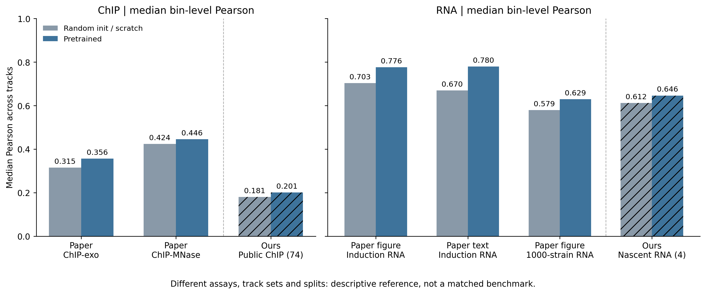

# Public supervised adaptation: 74 ChIP + 4 nascent RNA tracks

This campaign extends the community PyTorch port with a public-data supervised
adaptation. It does **not** reproduce the original 5,215-track data distribution.
The previous language-model release and its fixed-window PPL evaluation remain
separate. Do not assign that PPL score to this campaign's initialization.

## Data and evaluation

The admitted cache contains 1,855 windows of 16,384 input bases, with 896 output
bins at 16 bp resolution and 78 targets. Track indices 0–73 denote public ChIP;
74–77 denote two WT nascent polyA 5-prime-tag conditions × two strands.
The RNA tracks are not four independent biological replicates. The RC partner
map is identity for ChIP and swaps 74/75 and 76/77.

For test fold f, validation is (f+1) mod 8; the other six folds train the model.
Fold window counts are 229, 241, 247, 222, 237, 206, 249 and 224. Each window's
OOF prediction comes from its held-out model, not an eight-model ensemble that
includes models trained on that window. Predictions average forward and RC
orientations with strand reorientation.

All 16 models reached validation patience. Checkpoint hashes, OOF identities,
prediction dimensions, finite nonnegative values and cache hashes were checked.
Pooled OOF metrics are computed per track after assembling all folds, then
summarized across tracks. Overlapping windows repeat genomic positions; bins
must not be treated as independent statistical replicates.

| Track mean | Scratch | Pretrained | Tracks improving |
|---|---:|---:|---:|
| ChIP Pearson | 0.203469 | 0.223263 | 65/74 |
| ChIP Spearman | 0.178265 | 0.195065 | 68/74 |
| ChIP R² | 0.058090 | 0.072387 | 70/74 |
| RNA Pearson | 0.589980 | 0.633575 | 4/4 |
| RNA Spearman | 0.766001 | 0.793557 | 4/4 |
| RNA R² | 0.348359 | 0.401319 | 4/4 |

Source tables are in `benchmarks/public-chip74-rna4-v4/`. There are no claimed
confidence intervals or independent-replicate significance tests.

## Training protocol

Batch 8; FP32; TF32 off; seed 44; KerasAdam betas (0.9, 0.999), epsilon 1e-7;
global gradient norm clip 0.1 with nonfinite rejection; 5,000-step warmup;
base LR 2e-5 for pretrained and 5e-4 for scratch. Pretrained inputs retain 170
channels (absolute species column 114); scratch uses four DNA channels.
These differences mean this is a pipeline comparison, not a single-factor
pretraining causal estimate.

Selection uses validation mean Pearson + mean standard R² / 4. At least 50
epochs are required before stopping; more than 150 non-improving epochs stop
training; the limit is 5,000 epochs. Each epoch uses a full NumPy permutation
and full batches, capped at 500 steps. This differs from upstream buffered
TFRecord shuffling. No RC augmentation is used during this training protocol.
Scratch models ran 195–209 epochs; pretrained models ran 251–298 epochs.

The four-process campaign completed in approximately 8.48 hours on one H100
80GB according to its queue clock, including validation and OOF. This is not
a controlled end-to-end speedup measurement or a cloud billing statement.
Processes trained independent models; they did not share gradients. Formal
training did not use the GPU-resident cache variant tested in short benchmarks.

## Explicit loss adaptation

For a sample/track, let p=softplus(z), S=sum(p), Y=sum(y), q=p/S, B=896:

```
L = mean_sample,track[-sum(y * log(q))/B + 0.2*(S - Y*log(S))/B] + routed_L2
```

`normalized-lograte-v4` uses log-softplus and logsumexp directly from logits.
Empty targets contribute zero profile loss. It removes the original epsilon
pseudocount path; it is **not numerical parity with the upstream epsilon
formula**. Continuous normalized tracks also must not be described as raw
integer-count likelihoods without qualification. Earlier nonfinite-gradient
runs are excluded from this benchmark. The corrected objective was tested
against an independent FP64 reference and extreme logits; resume checks matched
model, optimizer, training and RNG states across an epoch boundary.

## Comparison with the paper



This figure uses track medians, whereas the table above uses means. Our ChIP
median Pearson is 0.2005 and RNA median is 0.6463. Archived Figure 3C values
are 0.356 for ChIP-exo and 0.776 for induction RNA; different assays and splits
prevent a matched ranking. Paper-text and archived-panel RNA baselines differ
(approximately 0.67 versus 0.703), so both references are distinguished.
No paper Spearman or standard R² bars are invented. Gene-level and normalized
cross-condition metrics remain future work.

## Availability and limitations

We release code and derived evaluation summaries. Raw sequences, BigWigs,
processed target caches, private strain data and operational logs are not part
of this repository. Public accessibility is not a blanket redistribution grant:
source dataset licenses and accession-specific terms still apply. The
[channel manifest](../benchmarks/public-chip74-rna4-v4/channels.json) records all
78 output indices, public accessions, source checksums and reverse-complement
partners. RNA source semantics remain conditional: a read1 filename versus
read2 metadata discrepancy has not been fully reconstructed. These targets
are published nascent RNA tags, not steady-state RNA coverage.

Weights must be exported from the exact best checkpoints and verified against
the OOF hashes before publication. No optimizer, RNG, credentials or private
checkpoint metadata should be distributed. This is a research baseline, not a
validated promoter/terminator/intron design model. No wet-lab efficacy is claimed.

References: [paper](https://elifesciences.org/reviewed-preprints/112217),
[official code](https://github.com/calico/shorkie-paper).
